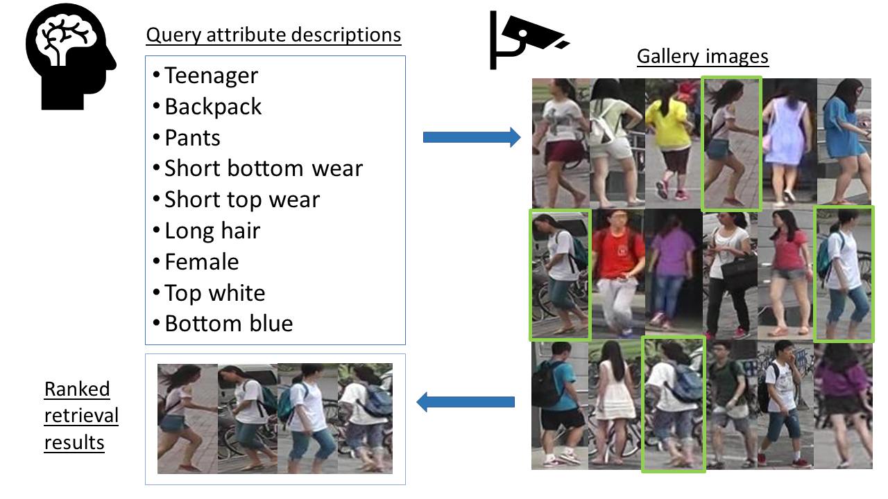
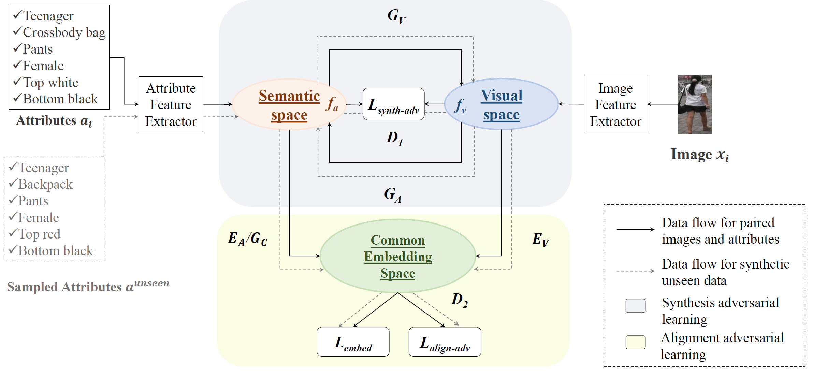

# Symbiotic Adversarial Learning for Attribute-based Person Search
PyTorch implementation of [Symbiotic Adversarial Learning for Attribute-based Person Search](https://arxiv.org/abs/2007.09609) (ECCV2020).

## Update
01/08/21: Updated [requirements.txt](requirements.txt). Upgrading Pillow to version 8.2.0 or later due to some issues in Pillow.

28/02/21: Updated [train.py](train.py) and [scripts](scripts). Uploaded [trained models](https://hkustconnect-my.sharepoint.com/:f:/g/personal/ycaoaf_connect_ust_hk/EqOH1p24IvtCid8o914_ai8BrP1SuXZT56JQbEhoVP_IxA?e=hN5IWI).

## Problem setting
<p align="center">
  
</p>

## Proposed model
<p align="center">
  
</p>


## Requirements

Python 3

h5py>=2.8.0

scipy>=1.1.0

requests>=2.20.1

torchvision=>0.2.1

Cython>=0.29.12

numpy>=1.13.3

pytorch>=0.4.1

Pillow>=7.2.0

## Installation
1. Run `git clone https://github.com/ycao5602/SAL.git`.
2. Install dependencies by `pip install -r requirements.txt` (if necessary).
3. To install the cython-based evaluation toolbox, `cd` to `torchreid/eval_cylib` and do `make`. As a result, `eval_metrics_cy.so` is generated under the same folder. Run `python test_cython.py` to test if the toolbox is installed successfully (credit to [luzai](https://github.com/luzai)).

## Datasets
Image-reid datasets:
- [Market1501](https://www.cv-foundation.org/openaccess/content_iccv_2015/papers/Zheng_Scalable_Person_Re-Identification_ICCV_2015_paper.pdf) [Market-1501 attribute](https://arxiv.org/abs/1703.07220) (`market1501`) (both should be downloaded for training)
- [PETA](http://mmlab.ie.cuhk.edu.hk/projects/PETA.html) (`peta`)

After downloading [Market1501](http://zheng-lab.cecs.anu.edu.au/Project/project_reid.html) and the [attribute annotations](https://github.com/vana77/Market-1501_Attribute), the directory should be organized as, 
```
├── root
│   ├── Market-1501
│       ├── bounding_box_test
│       ├── bounding_box_train
│       ├── query
│       ├── attribute
│           ├── market_attribute.mat
```

After downloading [PETA](https://github.com/dangweili/pedestrian-attribute-recognition-pytorch), the directory should be organized as,
```
├── root
│   ├── PETA
│       ├── 00001.png
│       ...
│   ├── PETA.mat
```
 Part of the data preparation code credits to [Kevin.h](https://github.com/hyk1996/Person-Attribute-Recognition-MarketDuke).

## Backbone Model
- [ResNet](https://arxiv.org/abs/1512.03385)

## Tutorial
### Train
Training methods are implemented in [train.py](train.py)

Input arguments for the above training scripts are unified in [args.py](args.py).

Training scripts in [scripts](scripts). `sh peta.sh` or `sh market.sh` (`sh market_alt.sh` for better results on `market1501`) to run.


### Test

#### Evaluation mode
Use `--evaluate` to switch to the evaluation mode. Doing so, **no** model training is performed. 

To resume an image branch pretrained model from checkpoints, the example script is
```bash
python train.py \
-s market1501 \ 
--test-batch-size 100 \
--evaluate \
-a resnet50 \
--resume-i1 dir/checkpoint_ep_al_I1.pth.tar \
--resume-i2 dir/checkpoint_ep_al_I2.pth.tar \
--resume-i2sem dir/checkpoint_ep_al_I2sem.pth.tar \
--resume-x dir/checkpoint_ep_al_x.pth.tar \
--save-dir log/eval \
--gpu-devices 0 
```

To resume a jointly pretrained model from checkpoints, the example script is
```bash
python train.py \
-s market1501 \ 
--test-batch-size 100 \
--evaluate \
-a resnet50 \
--resume-i1 dir/checkpoint_ep_al_I1.pth.tar \
--resume-g dir/checkpoint_ep_al_G.pth.tar \
--resume-i2 dir/checkpoint_ep_al_I2.pth.tar \
--resume-i2sem dir/checkpoint_ep_al_I2sem.pth.tar \
--resume-a dir/checkpoint_ep_al_a.pth.tar \
--resume-x dir/checkpoint_ep_al_x.pth.tar \
--save-dir log/eval \
--gpu-devices 0 
```

To resume a full SAL model from checkpoints, , the example script is
```bash
python train.py \
-s market1501 \ 
--test-batch-size 100 \
--evaluate \
-a resnet50 \
--resume-i1 dir/checkpoint_ep_al_I1.pth.tar \
--resume-g dir/checkpoint_ep_al_G.pth.tar \
--resume-i2 dir/checkpoint_ep_al_I2.pth.tar \
--resume-i2sem dir/checkpoint_ep_al_I2sem.pth.tar \
--resume-gx dir/checkpoint_ep_al_GX.pth.tar \
--resume-ga dir/checkpoint_ep_al_GA.pth.tar \
--resume-dc dir/checkpoint_ep_al_DC.pth.tar \
--resume-a dir/checkpoint_ep_al_a.pth.tar \
--resume-x dir/checkpoint_ep_al_x.pth.tar \
--resume-ds dir/checkpoint_ep_al_DS.pth.tar \
--save-dir log/eval \
--gpu-devices 0 
```

#### Evaluation frequency
Use `--eval-freq` to control the evaluation frequency and `--start-eval` to indicate when to start counting the evaluation frequency. This is useful when you want to test the model for every `--eval-freq` epochs to diagnose the training.

#### Visualize ranked results
Ranked results can be visualized via `--visualize-ranks`, which works along with `--evaluate`. Ranked images will be saved in `save_dir/ranked_results/dataset_name` where `save_dir` is the directory you specify with `--save-dir`. This function is implemented in [torchreid/utils/reidtools.py](torchreid/utils/reidtools.py).

#### Trained models
Pretrained and state-of-the-art models can be downloaded from [url](https://hkustconnect-my.sharepoint.com/:f:/g/personal/ycaoaf_connect_ust_hk/EqOH1p24IvtCid8o914_ai8BrP1SuXZT56JQbEhoVP_IxA?e=hN5IWI).

## Citation
If you find this code useful to your research, please cite the following paper

    @inproceedings{cao2020symbiotic,
    title={Symbiotic Adversarial Learning for Attribute-based Person Search},
    author={Cao, Yu-Tong and Wang, Jingya and Tao, Dacheng},
    booktitle={European Conference on Computer Vision},
    pages={230--247},
    year={2020},
    organization={Springer}
    }
## Related
The project is developed based on [deep-person-reid](https://github.com/KaiyangZhou/deep-person-reid).
    
    @article{torchreid,
      title={Torchreid: A Library for Deep Learning Person Re-Identification in Pytorch},
      author={Zhou, Kaiyang and Xiang, Tao},
      journal={arXiv preprint arXiv:1910.10093},
      year={2019}
    }
    
    @inproceedings{zhou2019osnet,
      title={Omni-Scale Feature Learning for Person Re-Identification},
      author={Zhou, Kaiyang and Yang, Yongxin and Cavallaro, Andrea and Xiang, Tao},
      booktitle={ICCV},
      year={2019}
    }

    @article{zhou2019learning,
      title={Learning Generalisable Omni-Scale Representations for Person Re-Identification},
      author={Zhou, Kaiyang and Yang, Yongxin and Cavallaro, Andrea and Xiang, Tao},
      journal={arXiv preprint arXiv:1910.06827},
      year={2019}
    }

   
## License
This project is under the [MIT License](LICENSE).
